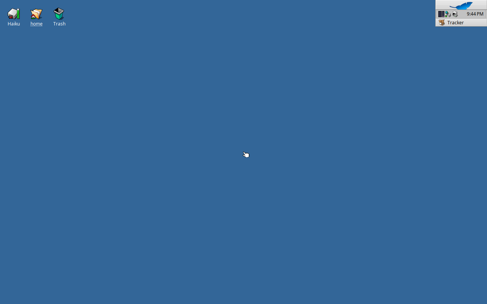

# Verified stock baseline

On 2026-09-20, the [baseline image build](https://github.com/Drmgiver/OSTen/actions/runs/35537491065)
completed and uploaded `haiku-nightly.image`. It used OSTen source commit
`69a31d1e62e1e2a42cdc427a334922f05d04ccd5` and Haiku buildtools commit
`8375c2dbeaf109c520798cb234d57f0895463201`.

The [QEMU boot check](https://github.com/Drmgiver/OSTen/actions/runs/35539372623)
started that image with 2048 MiB of RAM, two virtual CPUs, an IDE disk, VGA,
and a temporary snapshot. The first capture displayed Haiku's Welcome
dialog. After sending Enter to its default **Try it out** button, the next
capture displayed the desktop with the Haiku disk, home, Trash, and Deskbar.
The image therefore passed the stock build-and-desktop-boot milestone.

This is still Haiku's desktop. The OSTen System, Finder, and file behavior
described in [Project.md](Project.md) remain to be implemented and verified.
